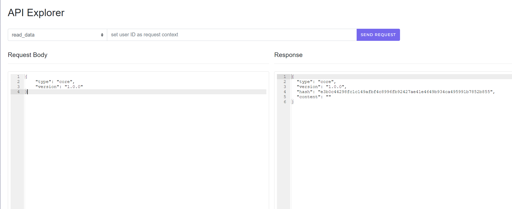

This Nakama implementation example was built using [Nakama Project Template](https://github.com/heroiclabs/nakama-project-template)
===

### Prerequisites

The codebase requires these development tools:

* Go compiler and runtime: 1.15.2 or greater.
* Docker Engine: 19.0.0 or greater.
* Node v14 (active LTS) or greater.
* Basic UNIX tools or knowledge on the Windows equivalents.

### Go Dependencies

The project uses Go modules which should be vendored before running docker compose:

```shell
go mod vendor
```

### Start

`docker-compose.yml` file contains the configurations necessary to build and run the Nakama Server as well as a postgres server where we will store our custoim data.

To start the build run
```shell
docker-compose up
```

Go to [Nakama Console](http://127.0.0.1:7351) and use the default credentials to log in
```
Default username: admin
Default password: password
```

Use the [Nakama Console's API Explorer](http://127.0.0.1:7351/apiexplorer) to execute RPCs.

Our custom RPC is named `read_data` select it and send the following as the request body
```
{
  "type": "core",
  "version": "1.0.0"
}
```



The RPC is meant to read the contents of the provided file provided by the request `$type/$version.json`

For that purpose The Dockerfile is configured to move the existing file named with the default values (`core/1.0.0.json`) to `/nakama/data/core/1.0.0.json`

The RPC will return an error if the file provided in the request doesnt exist.
